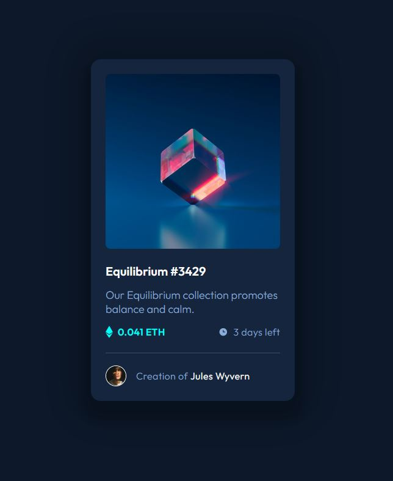

# Frontend Mentor - NFT preview card component solution

This is a solution to the [NFT preview card component challenge on Frontend Mentor](https://www.frontendmentor.io/challenges/nft-preview-card-component-SbdUL_w0U). Frontend Mentor challenges help you improve your coding skills by building realistic projects. 

## Table of contents

- [Overview](#overview)
  - [The challenge](#the-challenge)
  - [Screenshot](#screenshot)
  - [Links](#links)
  - [Running locally](#running)
- [My process](#my-process)
  - [Built with](#built-with)
  - [Useful resources](#useful-resources)
- [Author](#author)
- [Acknowledgments](#acknowledgments)


## Overview

### The challenge

Users should be able to:

- View the optimal layout depending on their device's screen size
- See hover states for interactive elements

### Screenshot



### Links

- Solution URL: [Add solution URL here](https://your-solution-url.com)
- Live Site URL: [Add live site URL here](https://your-live-site-url.com)

### Running locally

To run in development mode:

$ ```yarn```

$ ```yarn dev```

## My process

### Built with

- Scss
- [Vue.js 3](https://vuejs.org/)
- [Vite](https://vitejs.dev/)


### Useful resources

- [Multiple shadow in CSS](https://www.entheosweb.com/tutorials/css/multiple_shadows.asp) - This helped me to understand box-shadow attribute and how to create multiple shadows.

## Author

- Linkedin - [Lana Schuster](linkedin.com/in/lana-schuster-48b896195/)
- Frontend Mentor - [@lanaschuster](https://www.frontendmentor.io/profile/lanaschuster)

